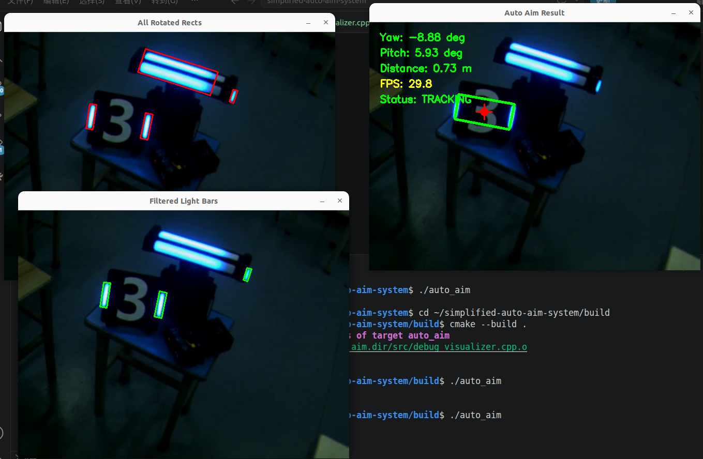
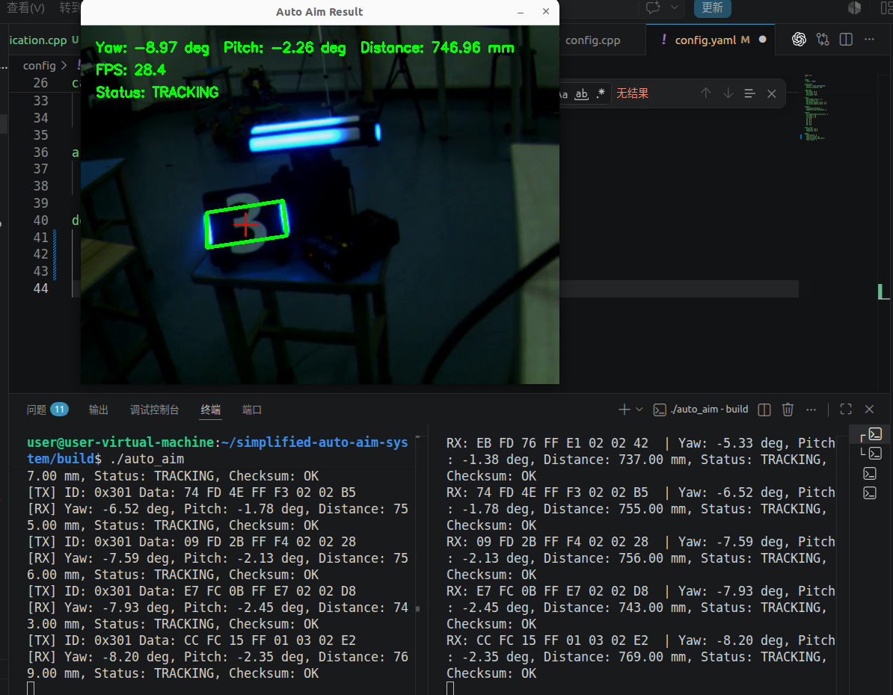

# Simplified Auto Aim System

一个基于 C++ 和 OpenCV 实现的简化装甲板自动瞄准系统。

项目以测试视频作为输入，完成图像预处理、灯条检测、装甲板匹配、目标选择和 PnP 位姿解算，并在运行窗口中显示目标位置、Yaw、Pitch、距离、FPS 和目标状态。

当前项目主要用于完成自动瞄准视觉流程的基础实现，重点是建立完整、模块化且便于调试的处理流程。

## 目录

- [1. 项目简介](#1-项目简介)
- [2. 项目结构](#2-项目结构)
- [3. 环境配置与运行](#3-环境配置与运行)
- [4. 参数配置](#4-参数配置)
- [5. 运行效果](#5-运行效果)
- [6. 当前不足](#6-当前不足)
- [7. 通信模块](#7-通信模块)
- [8. 问题记录与改进说明](#8-问题记录与改进说明)

---

## 1. 实现流程

程序整体处理流程如下：

```text
读取视频
   ↓
图像预处理
   ↓
轮廓提取
   ↓
灯条筛选
   ↓
灯条配对
   ↓
生成装甲板候选
   ↓
选择当前目标
   ↓
solvePnP 位姿解算
   ↓
计算 Yaw / Pitch / Distance
   ↓
显示并保存结果
```

### 图像预处理

程序支持灰度阈值和颜色差分两种预处理方式。

当前测试视频使用蓝色目标，因此采用：

```text
B - R
```

进行颜色差分，再通过阈值二值化突出蓝色区域。

### 灯条检测

在二值图中提取轮廓，并使用 `minAreaRect` 得到旋转矩形。

根据以下条件筛选灯条：

- 最小面积
- 长宽比
- 倾斜角度

这样可以过滤较小的噪声以及明显的水平干扰区域。

### 装甲板匹配

将筛选后的灯条两两组合，并根据几何关系判断是否能够构成装甲板，主要考虑：

- 两灯条高度差异
- 两灯条中心高度差
- 装甲板整体宽高比

满足条件的灯条对会生成一个装甲板候选。

### 目标选择

当一帧中存在多个候选目标时，程序会选择一个作为当前目标。

首次检测时优先选择靠近图像中心的候选；已经存在历史目标时，则优先选择距离上一帧目标中心最近的候选，从而减少目标在多个候选之间频繁跳变。

目标状态分为：

```text
NO_TARGET
DETECTED
TRACKING
TEMP_LOST
```

短时间检测不到目标时不会立即清除跟踪状态，只有连续丢失超过设定帧数后才进入 `NO_TARGET`。

### 位姿解算

程序根据装甲板四个角点的二维坐标和装甲板实际尺寸，通过 OpenCV `solvePnP` 计算目标相对于相机的三维位置，并进一步得到：

```text
Yaw
Pitch
Distance
```

当前没有使用真实相机标定结果，而是根据图像尺寸构造近似相机内参，因此位姿数据主要用于验证完整的 PnP 解算流程，不能作为高精度测量结果。

---

## 2. 项目结构

```text
simplified-auto-aim-system/
├── CMakeLists.txt
├── config/
│   └── config.yaml
├── include/
│   ├── video_reader.hpp
│   ├── armor_detector.hpp
│   ├── target_selector.hpp
│   ├── pose_solver.hpp
│   ├── debug_visualizer.hpp
│   └── config.hpp
├── src/
│   ├── main.cpp
│   ├── video_reader.cpp
│   ├── armor_detector.cpp
│   ├── target_selector.cpp
│   ├── pose_solver.cpp
│   ├── debug_visualizer.cpp
│   └── config.cpp
├── videos/
│   └── test.mp4
└── output/
    └── result.avi
```

各模块职责如下：

| 模块 | 作用 |
| --- | --- |
| `VideoReader` | 读取测试视频和视频 FPS |
| `ArmorDetector` | 图像预处理、灯条筛选和装甲板匹配 |
| `TargetSelector` | 目标选择、简单目标保持和状态管理 |
| `PoseSolver` | solvePnP 位姿解算，计算 Yaw、Pitch 和距离 |
| `DebugVisualizer` | 显示中间结果、最终结果并保存输出视频 |
| `Config` | 从 YAML 文件读取检测和调试参数 |

`main.cpp` 只负责组织各模块的调用，不直接实现具体的检测算法。

---

## 3. 编译与运行

项目测试环境：

```text
Ubuntu 22.04
C++17
OpenCV 4.5.4
CMake
```

进入项目目录并编译：

```bash
mkdir -p build
cd build
cmake ..
cmake --build .
```

运行：

```bash
./auto_aim
```

默认输入视频：

```text
videos/test.mp4
```

处理后的结果视频保存在：

```text
output/result.avi
```

输出视频使用 MJPG 编码的 AVI 格式，以保证当前 Ubuntu/OpenCV 环境下的播放兼容性。

---

## 4. 参数配置

主要参数统一放在：

```text
config/config.yaml
```

当前使用的主要参数包括：

```yaml
enemy:
  color: "blue"

preprocess:
  method: "color_difference"
  binary_threshold: 150

light_bar:
  min_area: 10.0
  min_ratio: 1.6
  min_angle: 60.0

armor:
  max_height_ratio: 1.5
  max_y_ratio: 0.7
  min_armor_aspect_ratio: 1.5
  max_armor_aspect_ratio: 5.0

target:
  tracking_threshold: 3
  temporary_lost_threshold: 5
```

其中 `min_ratio` 和 `max_y_ratio` 根据当前测试视频进行了适当调整，以减少目标发生倾斜、运动或发光区域变化时的漏检。

相机参数、装甲板实际尺寸以及调试窗口开关也可以在该文件中修改。

---

## 5. 调试与输出

程序可以显示以下窗口：

```text
Binary
All Rotated Rects
Filtered Light Bars
Auto Aim Result
```

这些窗口可以通过 `config.yaml` 中的 `debug` 参数分别开启或关闭。

最终结果窗口中会显示：

- 装甲板候选框
- 当前选中的目标
- Yaw
- Pitch
- Distance
- FPS
- Target Status

同时程序会将最终结果保存为 `output/result.avi`，便于运行结束后检查完整检测效果。

### 运行截图



### 运行视频

完整运行结果保存在：

[`output/result.avi`](output/result.avi)

视频记录了装甲板检测、目标选择、位姿解算以及目标状态变化的完整过程。

由于ubuntu好像不支持直接播放 mp4 格式的视频所以根据 gpt 的推荐，保存为 avi 格式。

也可以将以下 mp4 下载到本地看效果：

[`output/result.mp4`](output/result.mp4)

---

## 6. 当前效果与不足

目前已经完成从视频输入到目标位姿输出的完整基础流程，在提供的测试视频上能够较稳定地检测和跟踪蓝色装甲板，并对短时间目标丢失进行简单处理。

当前仍有以下限制：

- 检测参数主要针对现有测试视频调整，环境变化较大时需要重新调参。
- 灯条端点根据近似竖直灯条计算，目标发生较大倾斜时精度会下降。
- 当前使用近似相机内参，Yaw、Pitch 和距离只用于验证位姿解算流程。
- `camera.use_approximate_intrinsics` 目前作为后续接入真实相机标定参数的预留配置，暂未实现内参模式切换。
- 当前目标保持采用上一帧目标中心和丢失计数器，没有加入运动预测等复杂跟踪算法。

后续如果接入真实相机，可以在现有结构上继续加入相机标定参数、实时视频输入以及更稳定的目标跟踪方法。

## 7. 通信模块

在完成装甲板检测和位姿解算后，需要把视觉端得到的数据发送给下位机。由于目前没有实际的 CAN 设备，本阶段先按照 CAN 报文的形式设计 8 字节数据帧，并在程序中完成编码、解码和校验。之后又使用 UDP 在本机上模拟两个程序之间的实际通信。

### 7.1 发送的数据

目前发送的数据包括：

- yaw：目标相对相机的水平偏角，单位为 °
- pitch：目标相对相机的俯仰角，单位为 °
- distance：目标距离，单位为 mm
- status：当前目标状态
- checksum：用于检查数据在传输过程中是否发生错误

目标状态定义如下：

| 数值 | 状态 |
| --- | --- |
| 0 | NO_TARGET |
| 1 | DETECTED |
| 2 | TRACKING |
| 3 | TEMP_LOST |

没有有效位姿时，yaw、pitch 和 distance 发送 0，但仍然发送当前目标状态。这样接收端可以区分“没有目标”和“没有收到数据”。

### 7.2 报文格式

本项目使用固定 8 字节数据帧模拟 CAN 通信，CAN ID 设为 `0x301`。一帧数据中包含 yaw、pitch、distance、目标状态和校验和。

| 字节位置 | 字段 | 数据类型 | 单位/精度 | 说明 |
| --- | --- | --- | --- | --- |
| Byte 0 | yaw_L | `uint8_t` | 0.01° | yaw 低 8 位 |
| Byte 1 | yaw_H | `uint8_t` | 0.01° | yaw 高 8 位 |
| Byte 2 | pitch_L | `uint8_t` | 0.01° | pitch 低 8 位 |
| Byte 3 | pitch_H | `uint8_t` | 0.01° | pitch 高 8 位 |
| Byte 4 | distance_L | `uint8_t` | mm | distance 低 8 位 |
| Byte 5 | distance_H | `uint8_t` | mm | distance 高 8 位 |
| Byte 6 | status | `uint8_t` | - | 目标状态 |
| Byte 7 | checksum | `uint8_t` | - | 前 7 字节校验和 |

其中 yaw 和 pitch 在发送前乘以 100，再转换为 `int16_t`；distance 以 mm 为单位取整后转换为 `uint16_t`。多字节数据统一采用小端序，即低字节在前、高字节在后。

目标状态规定为：

| 数值 | 状态 | 含义 |
| --- | --- | --- |
| `0x00` | `NO_TARGET` | 当前没有目标 |
| `0x01` | `DETECTED` | 已检测到目标 |
| `0x02` | `TRACKING` | 正在稳定跟踪目标 |
| `0x03` | `TEMP_LOST` | 目标暂时丢失 |

例如发送：

- yaw = `4.23°`
- pitch = `-1.57°`
- distance = `600 mm`
- status = `TRACKING`

编码后的数据为：

```text
CAN ID: 0x301

A7 01 63 FF 58 02 02 66
```

对应关系为：

```text
A7 01    yaw = 423 / 100 = 4.23°
63 FF    pitch = -157 / 100 = -1.57°
58 02    distance = 600 mm
02       TRACKING
66       checksum
```

checksum 的计算方式为将 Byte 0～Byte 6 相加，并保留结果的低 8 位：

```text
checksum = (Byte0 + Byte1 + ... + Byte6) & 0xFF
```

接收端按照相同的字节序重新组合数据，并重新计算 checksum。如果计算结果与 Byte 7 相同，则认为该帧数据通过校验。

### 7.3 为什么要进行数据缩放

yaw 和 pitch 都带有小数，如果直接转换成整数会损失精度。因此发送前先乘 100，把 4.23° 转换为 423，接收后再除以 100，就可以保留到 0.01°。

distance 本身使用 mm，当前阶段直接取整后发送。

### 7.4 字节序

对于超过一个字节的数据，发送端和接收端需要规定相同的字节顺序，否则解析出来的数值会不一样。

这里统一使用小端序。例如：

`423 = 0x01A7`

发送时为：

`A7 01`

接收端再按照相同顺序组合回 `0x01A7`。

### 7.5 为什么不直接发送 float

`float` 一般需要 4 个字节。如果 yaw、pitch 和 distance 都直接使用 float，仅这三个数据就需要 12 个字节，已经超过了这里设计的 8 字节数据帧。

另外直接传 float 还需要考虑两端的数据表示方式和字节序。对于目前需要的精度，把角度乘 100 后用 `int16_t` 保存更简单，也能减少需要发送的数据量。

### 7.6 无目标时的数据

无目标或者暂时无法得到有效位姿时，仍然发送一帧数据：

- yaw = 0
- pitch = 0
- distance = 0
- status 使用当前实际目标状态

例如完全没有目标时发送 `NO_TARGET`，短暂丢失时发送 `TEMP_LOST`。

这样应该比直接停止发送更好，因为接收端仍然能够知道视觉程序正在运行，只是当前没有有效目标。

### 7.7 数据校验

Byte 7 用作 checksum。

发送端将 Byte 0 到 Byte 6 相加，只保留结果的低 8 位：

`checksum = (Byte0 + Byte1 + ... + Byte6) & 0xFF`

接收端收到数据后重新计算 checksum，并和 Byte 7 比较。

测试时人为修改报文中的一个字节，正常报文显示：

`Checksum: OK`

修改后的报文显示：

`Checksum: ERROR`

说明这种方法是可行的。

### 7.8 UDP 通信测试

在完成基本的报文编码和解码后，又使用 UDP 做了本机通信测试。

`auto_aim` 将每帧视觉结果编码成 8 字节数据，通过 UDP 发送到：

`127.0.0.1:9000`

`udp_receiver` 持续接收数据，完成解码和 checksum 检查，并输出 yaw、pitch、distance 和目标状态。

这里使用 `127.0.0.1` 是为了先在同一台电脑上模拟两个独立程序之间的通信，没有使用实际 CAN 设备。

先打开一个终端，进入 `build` 目录并运行接收端：

```bash
cd build
./udp_receiver
```

然后打开另一个终端，运行视觉程序：

```bash
cd build
./auto_aim
```

运行后，接收端会持续输出收到的 8 字节数据以及解析后的结果，例如：

```text
RX: A7 01 63 FF 58 02 02 66 | Yaw: 4.23 deg, Pitch: -1.57 deg, Distance: 600.00 mm, Status: TRACKING, Checksum: OK
```

通过这个测试，可以看到视觉程序得到的数据已经能够经过 UDP 发送到另一个程序，并在接收端正确还原。

### 7.9 运行结果

实际运行时，先启动 `udp_receiver`，再运行 `auto_aim`。视觉程序持续检测目标并计算 yaw、pitch 和 distance，同时将数据编码成 8 字节报文，通过 UDP 发送到接收端。

#### 运行截图

下图为视觉程序和 UDP 接收端同时运行时的结果：



也可以将以下视频下载到本地观看：

[`output/stage2_udp_result1.mp4`](output/stage2_udp_result1.mp4)

运行过程中，视觉端可以正常识别和跟踪装甲板，UDP 接收端能够持续收到对应的 8 字节数据。解码得到的 yaw、pitch、distance 和目标状态会随视觉检测结果变化，正常情况下 checksum 显示为 `OK`。

#### 通信输出记录

完整的 UDP 通信输出记录保存在：

[`output/communication_log.txt`](output/communication_log.txt)

其中记录了接收端收到的 8 字节报文，以及解码后的 yaw、pitch、distance、目标状态和 checksum 结果。

另外还对报文校验进行了单独测试，测试记录保存在：

[`output/communication_test_log.txt`](output/communication_test_log.txt)

测试中正常报文的校验结果为 `Checksum: OK`；人为修改报文中的一个字节后，校验结果变为 `Checksum: ERROR`，说明接收端能够检测到数据发生变化。

## 8. 问题记录与改进说明

### 8.1 开发过程中遇到的问题

#### 1. OpenCV 环境配置

一开始尝试在 Windows 下使用 MSYS2 配置 C++/OpenCV ，然后遇到了 CMake 查找和链接方面的问题。后面还是将项目放到 Ubuntu 22.04 下重新配置，使用系统安装的 OpenCV 。

#### 2. 灯条筛选参数需要根据实际视频调整

最开始只使用比较简单的阈值进行灯条筛选，会出现一些背景区域被误识别的问题。后面根据测试视频中的实际检测结果，对面积、长宽比、角度以及装甲板匹配条件进行了调整。

目前的方法能够完成测试视频中的识别，但这些可能仍然比较依赖当前场景，换到不同光照或不同距离下不一定还能保持相同效果，后续还需要在不同场景下再调整。

#### 3. 位姿解算使用的是近似相机参数

目前没有进行实际相机标定，相机内参是根据图像尺寸近似构造的，畸变参数也暂时设为 0。因此现在得到的 yaw、pitch 和 distance 可以用于完成流程验证，但距离等结果的精度还有提升空间。这个也可能是有些地方识别不是特别准确的原因之一。

后续可以完成相机标定，再使用实际内参和畸变参数进行 solvePnP。

#### 4. 目标短暂丢失时的处理

如果检测不到装甲板就立刻认为目标完全丢失，状态会比较容易跳变。因此增加了 `TEMP_LOST` 状态，允许目标短暂丢失几帧。

通信时即使没有有效位姿也会继续发送数据，将 yaw、pitch 和 distance 置为 0，同时发送当前目标状态，方便接收端判断视觉程序当前的情况。

#### 5. 通信数据的校验

最开始只是完成数据的编码和解码，之后增加了 checksum。测试时通过人为修改报文中的一个字节，验证了接收端能够得到 `Checksum: ERROR`。

目前使用的是简单的累加校验，能够满足本阶段测试需要，但检错能力比较有限。后续如果对通信可靠性要求更高，可以改为 CRC 等校验方式。

#### 6. 目标位姿可视化

我尝试用三维坐标可视化物体的三维位姿状况，但是可视化的时候 Y 轴一直不太稳定，会有小幅度的跳变，而且好像并不是始终垂直于 X-Z 平面的。这个问题我暂时还没解决，后面再看看怎么回事。

### 8.2 后续可以改进的地方

目前项目已经完成从装甲板检测、目标选择、位姿解算到通信发送的基本流程，但还有一些比较明显的改进空间：

- 使用实际相机标定参数，提高位姿解算精度；
- 在更多光照、距离和运动情况下测试并优化灯条和装甲板筛选；
- 对 yaw、pitch 和 distance 做适当滤波，减小检测结果的抖动；
- 进一步完善目标跟踪，减少短暂漏检对结果的影响；
- 将当前的模拟 CAN 报文进一步接入实际串口或 CAN 设备；
- 根据实际通信需求使用 CRC 等更可靠的校验方法。
