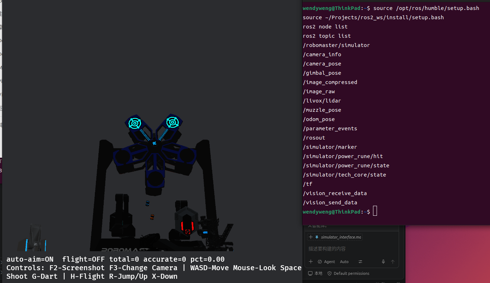
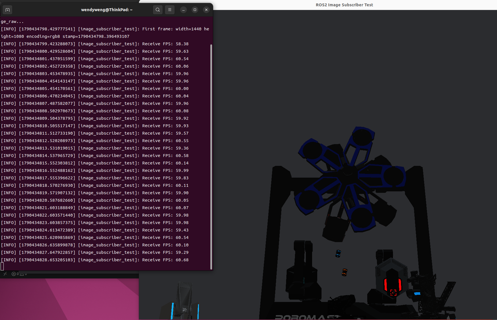
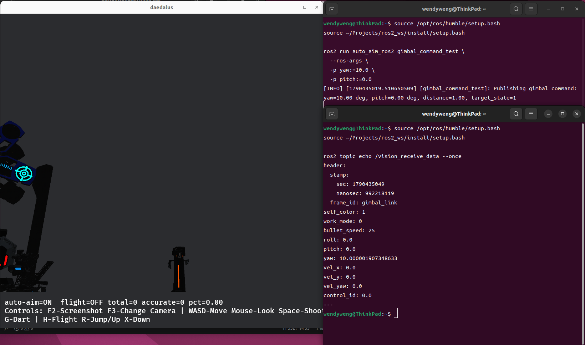
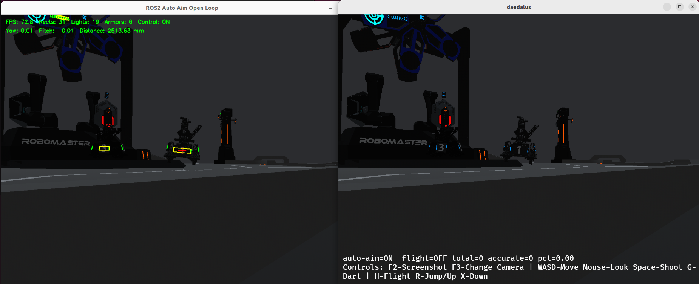
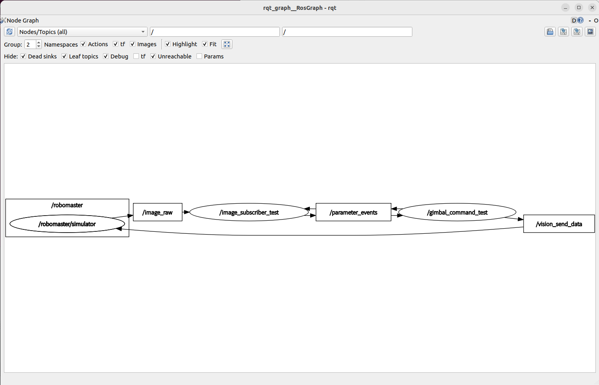

# 仿真部署与接口记录

## 1. 环境与版本

| 项目 | 配置 |
|---|---|
| 操作系统 | Ubuntu 22.04.5 LTS |
| ROS2 | Humble |
| OpenCV | 4.5.4 |
| CMake | 3.22.1 |
| G++ | 11.4.0 |
| 仿真器 Rust | 1.95.0 |
| GPU | NVIDIA RTX 1000 Ada |
| NVIDIA 驱动 | 595.91.07 |

仿真器：

```text
HNUYueLuRM/bevy_robomaster_simulator
```

使用的原始提交：

```text
479d8fd7d40863dbdc2e021f58ad297f9df9f8e9
```

仿真器 ROS2 修复分支和提交：

```text
fix/ros2-interface-compatibility
38228c7  Fix ROS2 interface compatibility
7c07570  Fix controlled robot color feedback
```

原自瞄项目开发分支：

```text
feature/simulator-integration
```

---

## 2. 仿真器启动

加载环境：

```bash
source /opt/ros/humble/setup.bash
source ~/Projects/ros2_ws/install/setup.bash
```

启动 ROS2 版本仿真器：

```bash
cd ~/Projects/bevy_robomaster_simulator
cargo run --release --no-default-features --features ros2
```

仿真器节点：

```text
/robomaster/simulator
```



---

## 3. ROS2 兼容修复

仿真器源码原本引用 `hnurm_interfaces`，但仓库实际提供的消息包为
`rm_interfaces`，消息名称和部分字段形式也不一致，导致 ROS2 feature
无法编译。

主要修改：

- 将 `hnurm_interfaces` 改为 `rm_interfaces`。
- 将 `VisionRecvData` 对应到 `VisionReceiveData`。
- 按实际消息定义调整 `uint8` 字段。
- 删除当前消息中不存在的字段。
- 将 `target_state.data` 改为 `target_state`。

修改后 ROS2 feature 可以正常编译和运行。

---

## 4. 接口记录

### 4.1 图像

| 项目 | 结果 |
|---|---|
| 话题 | `/image_raw` |
| 消息类型 | `sensor_msgs/msg/Image` |
| 编码 | `rgb8` |
| 分辨率 | 1440 × 1080 |
| 实际频率 | 约 59～60 FPS |
| frame_id | `camera_optical_frame` |
| QoS | RELIABLE、VOLATILE |

OpenCV 默认使用 BGR，因此订阅后通过 `cv_bridge` 将：

```text
rgb8 → BGR8
```

订阅队列深度设置为 1，只保留最新画面，避免积压旧帧。

### 4.2 相机参数

话题：

```text
/camera_info
```

内参：

```text
fx = 1303.6753
fy = 1303.6753
cx = 720.0
cy = 540.0
```

相机矩阵：

```text
[1303.6753, 0,         720]
[0,         1303.6753, 540]
[0,         0,         1  ]
```

畸变参数均为 0，内参对应 1440×1080 图像。后续 PnP 使用该参数，
不能直接沿用原视频参数。

### 4.3 云台命令

| 项目 | 结果 |
|---|---|
| 话题 | `/vision_send_data` |
| 消息类型 | `rm_interfaces/msg/VisionSendData` |
| 接口方向 | 自瞄程序发布，仿真器订阅 |
| QoS | BEST_EFFORT、VOLATILE |
| 角度单位 | 度 |
| 控制语义 | 世界参考下的绝对目标角度 |

方向关系：

```text
yaw 增大   → 云台向左
yaw 减小   → 云台向右
pitch 增大 → 云台向下
pitch 减小 → 云台向上
```

目标状态：

```text
target_state = 0：目标无效，停止追踪并保持当前姿态
target_state = 1：目标有效，不开火
target_state = 2：目标有效，并给出开火建议
```

`target_distance=-1` 也会被判断为无效目标。

### 4.4 云台状态

| 项目 | 结果 |
|---|---|
| 话题 | `/vision_receive_data` |
| 消息类型 | `rm_interfaces/msg/VisionReceiveData` |
| 接口方向 | 仿真器发布，自瞄程序订阅 |
| 发布频率 | 约 60 Hz |
| 当前弹速 | 25 m/s |

消息中包含当前 roll、pitch、yaw 和机器人状态。

### 4.5 坐标关系

`/gimbal_pose`、`/camera_pose` 和 `/odom_pose` 当前只发布恒等占位
Pose。实际坐标关系位于 `/tf`：

```text
map
└── odom
    └── gimbal_link
        ├── muzzle
        │   └── muzzle_link
        └── camera_link
            └── camera_optical_frame
```

第一版最小闭环直接使用 `/vision_receive_data` 获取云台角度，不进行复杂
TF 解算。

---

## 5. 最小通信测试

### 5.1 图像订阅测试

程序：

```text
ros2/auto_aim_ros2/src/image_subscriber_test.cpp
```

运行：

```bash
ros2 run auto_aim_ros2 image_subscriber_test
```

测试结果：

- 能够显示仿真实时画面。
- 图像为 1440×1080、`rgb8`。
- RGB 转 BGR 后颜色正常。
- 接收 FPS 稳定在约 59～60。
- 能输出时间戳。
- 移动机器人或云台时，画面实时变化。
- 按 `Q` 或 `Esc` 可以正常退出。

该测试证明：

```text
仿真器 → ROS2 → C++/OpenCV程序
```

已经连通。



### 5.2 云台命令测试

程序：

```text
ros2/auto_aim_ros2/src/gimbal_command_test.cpp
```

运行示例：

```bash
ros2 run auto_aim_ros2 gimbal_command_test \
  --ros-args \
  -p yaw:=10.0 \
  -p pitch:=0.0
```

测试结果：

- C++ 程序能够向仿真器发布云台命令。
- 云台能够逐渐运动到指定角度。
- 状态话题反馈角度与命令一致。
- yaw、pitch 正负方向符合接口记录。
- `target_state=0` 时不执行消息中的角度，并保持当前姿态。

该测试证明：

```text
C++程序 → ROS2 → 仿真器云台
```

已经连通。



---

## 6. 实时识别与最小闭环

节点复用原项目的装甲检测、目标选择和 PnP 模块。默认只进行开环识别：

```bash
ros2 run auto_aim_ros2 auto_aim_open_loop
```

显式开启闭环，并将单次角度修正限制为 1°：

```bash
ros2 run auto_aim_ros2 auto_aim_open_loop --ros-args \
  -p enable_control:=true \
  -p max_correction_deg:=1.0
```

识别算法输出相对画面中心的角度误差，结合
`/vision_receive_data` 中的当前姿态转换为绝对目标角度：

```text
目标绝对角度 = 当前云台角度 - 图像角度误差
```

安全机制：

- 控制默认关闭，必须通过参数显式开启。
- 目标进入 `TRACKING` 且 PnP 成功后才发送有效命令。
- 单次角度修正默认不超过 2°，测试时限制为 1°。
- 误差小于 0.15° 时不修正，减少中心附近抖动。
- 控制命令约以 17～20 Hz 发布。
- 目标丢失时发送 `target_state=0`、`target_distance=-1`，并保持当前姿态。
- 当前阶段只瞄准，不发送开火指令。

实测闭环能够将目标收敛至画面中心，稳定后角度误差约为 0.01°；
目标移出画面后，无效目标保护正常触发。



已知问题：相邻装甲板的内侧灯条偶尔会组成错误候选，上方连续灯条也可能
产生额外候选。目前最终目标选择基本稳定，不影响最小闭环验证；后续可通过
数字区域分类和更严格的候选匹配继续优化。

---

## 7. 数据流

```text
仿真虚拟相机
    ↓ /image_raw
图像订阅程序
    ↓ cv::Mat
装甲检测 → 目标选择 → PnP
    ↓ yaw / pitch / distance
安全限幅与绝对角度转换
    ↓ /vision_send_data
仿真云台运动
    ↓
产生新的相机画面
```



---

## 8. 主要问题与解决方法

| 问题 | 解决方法 |
|---|---|
| NVIDIA 驱动安装后未立即生效 | 重启 Ubuntu |
| 旧终端找不到 `ros2` | 执行 `source ~/.bashrc` |
| F3 被识别为音量键 | 使用 `Fn+F3` 或切换 Fn Lock |
| 方向键不能手动控制云台 | 将 `auto-aim` 切换为 OFF |
| ROS2 feature 无法编译 | 修正消息包名称、消息类型及字段 |
| `/gimbal_pose` 等始终为零 | 使用 `/tf` 或 `/vision_receive_data` |
| `self_color` 与受控机器人不一致 | 将红方受控机器人反馈修正为 `self_color=0` |
| 相邻装甲偶尔交叉配对 | 暂由目标选择抑制，后续增加数字分类与匹配约束 |

---

## 9. 当前结论

目前已经完成：

```text
仿真器部署
→ ROS2兼容修复
→ 接口确认
→ 图像订阅测试
→ 云台命令发布测试
→ 原算法实时开环识别
→ 安全限幅云台闭环
→ 目标丢失保护
```

原视频输入模式回归测试正常，ROS2 仿真模式已完成从图像输入、目标识别、
位姿解算到云台控制的最小闭环。

## 闭环测试结果

| 测试场景 | 测试结果 |
| --- | --- |
| 静止目标 | 云台能够将目标从画面偏移位置移动至中心，稳定后角度误差约为 0.01° |
| 运动目标 | 低速运动时可以持续跟踪；高速运动时存在一定滞后 |
| 己方移动 | 使用 W/A/S/D、Q/E 移动时，系统能够继续识别目标并调整云台 |
| 目标丢失 | 发布 `target_state: 0`、`target_distance: -1.0`，云台保持当前位置 |
| 图像中断 | 图像中断超过 200 ms 后触发超时保护；图像恢复后自动继续跟踪 |

当前闭环单次角度修正限制为 2°，控制消息频率约为 17 Hz。高速目标跟踪仍会受到误检、缺少运动预测以及云台物理速度限制的影响。

## 演示视频

[查看安全限幅云台闭环演示](videos/closed_loop_demo.webm)

视频展示了目标识别、云台闭环修正和运动过程中的持续跟踪。

## 已知问题

相邻装甲板的内侧灯条有时会被错误配对，产生额外的候选装甲板。目前最终目标通常仍能正确选择，因此暂不调整识别算法，后续再优化灯条配对和数字区域校验。
